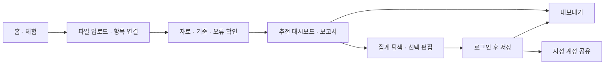

# HRBIP 웹 제작 흐름

- 버전: v0.2
- 최종 수정일: 2026-10-05
- 기준: [PRD v0.3](PRD.md), [질문·답변 정리](INTERVIEW_SUMMARY.md)
- 현재 상태: 계획 문서. 웹 구현 전.
- **사용자가 웹 제작을 명시적으로 요청한 뒤 착수한다. 지금은 코드·실행 환경·배포를 만들지 않는다.**
- 기간 제한 없이 의존 관계와 단계별 완료 기준에 따라 진행한다.

## 1. 사용자 흐름

추천 이유를 결과 아래에 표시한다. 오류가 생기면 사용자에게 처리 선택지를 주고, 자료가 없는 분석은 포함하지 않는다. 편집 없이도 기본 결과를 사용할 수 있다.

## 2. 화면 구성 제안

| 화면 | 역할 |
|---|---|
| 홈 | 도구 진입, 로그인 없는 체험 |
| 데이터 입력 | 파일·시트 선택, 항목 연결 추천·확인 |
| 데이터 확인 | 의미·단위·집계 기준·오류·분석 가능한 범위 확인 |
| 결과 작업 화면 | 대시보드·보고서 탭, 구성 이유, 필터, 차트 연동, 편집 |
| 내 작업 | 저장된 작업·보고서·템플릿 열기 |
| 공유 조회 | 지정 계정이 허용된 결과를 탐색 |

디자인은 흰색·초록·연두 중심으로 읽기 쉽고 정돈된 업무 화면을 지향한다. 편집은 추천 틀과 자동 정렬 구조를 사용한다.

## 3. 구현을 요청받은 뒤 진행할 순서

| 단계 | 작업 | 완료 기준 |
|---|---|---|
| 1. 데이터·기술 기준 | 지표 정의, 입력 구조, 기술·AI 연결·저장 방식 구체화 | 선택 근거와 필요한 데이터·접근 조건이 명확함 |
| 2. 화면 설계 | 결과 화면 중심으로 입력·검증·저장·공유 흐름 설계 | 사용자가 다음 행동과 결과를 이해할 수 있음 |
| 3. 데이터 처리 기반 | 가상 자료, 검증·정리·집계와 기본 화면 구현 | 정답을 아는 샘플에서 숫자와 오류 안내를 확인 |
| 4. 유연한 파일 입력 | 파일·시트 가져오기, 항목 연결, 오류 처리 선택 | 기존 양식을 지원 범위 안에서 읽고 모호한 내용을 확인 |
| 5. 추천 결과 | 종합 보고 영역별 지표·차트·기본 문장·추천 이유 | 가진 자료로만 생성하고 수치와 설명이 일치 |
| 6. 인터랙션·편집 | 필터·차트 연동, 수치 확인, 틀 안 편집·복원 | 조회 상태와 편집 상태가 구분되고 유지됨 |
| 7. AI 설명 | 검증된 집계로 사실·변화·확인 사항 작성 | 근거가 보이고 담당자 수정 내용을 보존 |
| 8. 계정·저장·공유 | 비로그인 체험, 로그인 저장, 원본 보관 선택, 지정 계정 조회 | 허용·비허용 계정과 데이터 접근을 실제 검증 |
| 9. 파일 출력 | PDF·편집 가능한 PPT·Excel과 출력 범위 확인 | 형식별 내용·배치·편집 가능성을 확인 |
| 10. 통합 검증·배포 | 오류·자료 부족·복원·재사용·권한·출력 점검, 사용자 피드백 | 핵심 흐름이 이어지고 실패 시 복구 가능 |

이 표는 예약된 작업이나 이미 수행한 작업이 아니다. 선택하지 않은 API·인증 서비스·배포 환경을 연결한 것으로 간주하지 않는다.

## 4. 정확도를 위해 연결할 사항

- 파일 종류별 기록 단위와 연결 기준을 구분한다.
- 원본, 작업용 데이터, 집계 결과, 사용자 설정을 구분한다.
- 같은 사번의 반복을 무조건 삭제하거나 자료 누락을 0으로 채우지 않는다.
- 모든 화면과 결과물에 기간·포함 대상·미포함 분석 범위가 일관되게 반영되도록 한다.
- 웹의 상호작용과 파일 형식의 편집 기능을 구분해 검증한다.
- 계정 제한은 공유 화면뿐 아니라 조회 데이터·다운로드에도 적용한다.
- 원본 파일 미보관과 분석 데이터 저장을 구분해 안내한다.
- 실제 효과를 측정하기 전에 자동화 효과가 입증됐다고 표현하지 않는다.

## 5. 확장 방향

- 기존 인사 프로그램 직접 연결.
- 요약·부서별·전체 보고 구성 선택.
- 실무에서 반복 필요가 확인된 HR 도구 추가.
- 필요성이 확인되면 Tableau 연계 검토.

## 6. 기록 방식

- 실제 수행·확인 결과는 [작업일지](WORKLOG.md)에 기록한다.
- 선택이나 변경의 이유는 [프로젝트 기록](PROJECT_LOG.md)에 기록한다.
- 요구사항이 바뀌면 [PRD](PRD.md)를 갱신한다.
- 현재 사용자 요청은 질문·답변 정리다. 웹을 만들라는 명시 요청을 받은 뒤 실제 구현을 진행한다.
